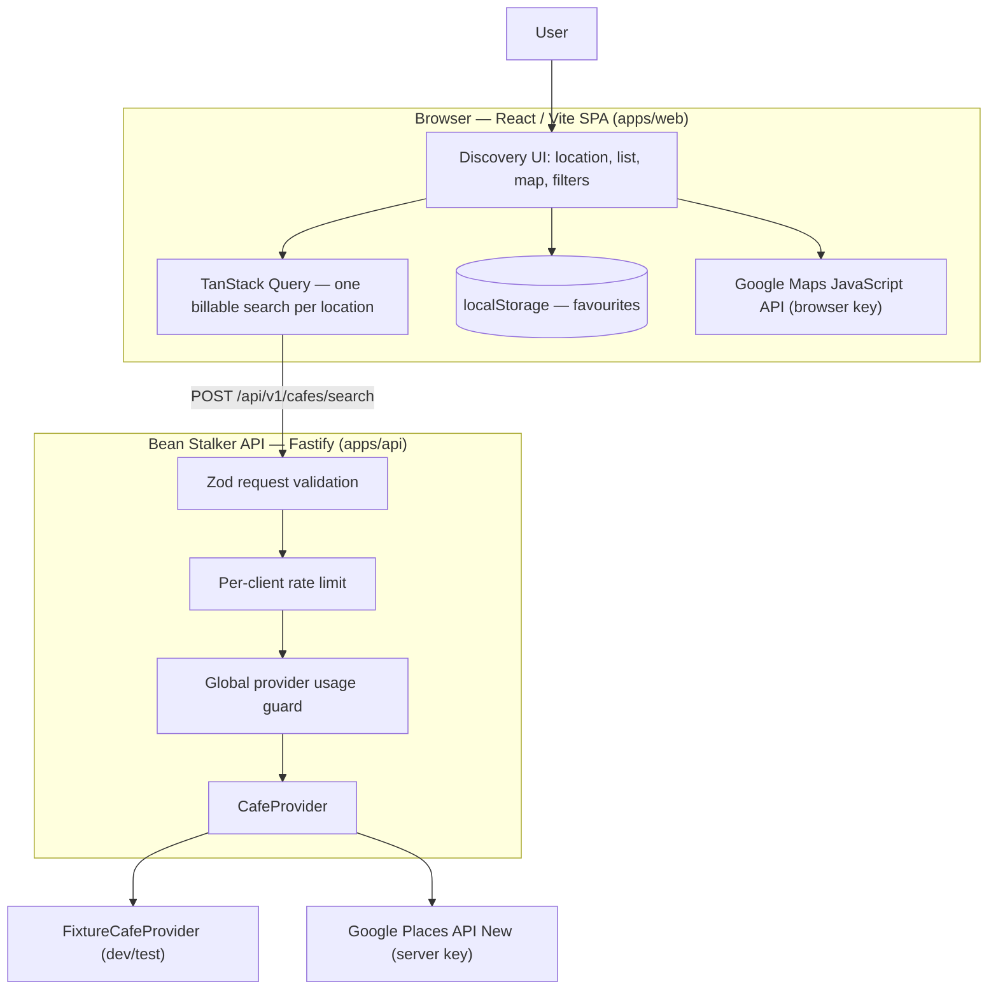

# Bean Stalker

A location-aware **cafe discovery** web app: pick a point (your location or a manual
latitude/longitude), search nearby cafes from Google Places data, then narrow the
results with filtering, sorting and local favourites — on an accessible list backed
by a synchronized map.

It is a compact full-stack TypeScript project built to show *how* an app handles the
parts that are usually an afterthought: a metered third-party API, sensitive location
input, runtime trust boundaries, failure behaviour, cost control, mobile usability
and accessibility.

---

## Status

| | |
|---|---|
| **P0 MVP** | Feature-complete |
| **Verification** | Fixture- and mock-verified end to end (291 unit/integration tests, 39 Playwright e2e) |
| **Live Google provider** | Implemented but **not yet smoke-tested** — blocked on Google Cloud billing / restricted-credential setup |
| **Deployment** | None. No production environment; deployment topology is deliberately unresolved |
| **Not** | production-ready, deployed, or WCAG-certified |

This is a **resume-ready MVP from the engineering and documentation perspective**,
with real-provider verification and production hardening explicitly deferred. See
[Known limitations](#known-limitations).

> No live Google Places request has ever been made from this repository. Local
> development and the entire test suite run against a fixture provider with zero
> billable traffic.

---

## Why Bean Stalker?

Generic map apps answer "what's around me?" with hundreds of undifferentiated pins.
Bean Stalker is a **focused** discovery flow for one category: it narrows cafes
around a chosen location and lets you sort by distance or rating, filter by minimum
rating or "open now", and keep a local shortlist — without an account.

The interesting part isn't the map. It's that the Google Places API is **metered**,
location input is **sensitive**, and an external dependency **fails** — so
request discipline, privacy-conscious data handling and honest failure states are
treated as architecture requirements, not polish.

---

## Features

All implemented and verified against fixtures/mocks:

- **Location** — optional browser geolocation, or manual latitude/longitude entry.
  A denied geolocation permission never blocks the app: the manual form is always
  available.
- **Search** — one nearby-cafe search per chosen location, through the Bean Stalker
  API (never the browser calling Google directly).
- **Accessible cafe list** — name, address, rating + review count, price level,
  open / closed / *hours unavailable*, straight-line distance, and an "Open in
  Google Maps" link *only when the provider supplied one*. Missing data is shown
  honestly, never faked.
- **Map** — a Google Maps view with one marker per cafe; selecting a card or a
  marker highlights the other. If the map fails to load, the list stays fully
  usable.
- **Refine locally** — minimum-rating filter, "open now only" filter, sort by
  distance or rating, reset. **None of these issue another provider request** —
  they transform the already-fetched results in the browser.
- **Favourites** — save / remove a cafe; favourites persist in `localStorage` on
  that browser and appear on a dedicated `/favorites` page. No account, no sync.
- **Explicit states** — distinct loading, empty, filtered-empty, permission-error
  and provider-error UI, with a manual (never automatic) retry.
- **Responsive & accessible** — usable from 320 px wide, keyboard-operable, with
  visible focus and screen-reader-appropriate status/alert semantics.

Not in the MVP: accounts, a database, cloud-synced favourites, search history,
reviews, photos, offline/PWA, and any deployed instance.

---

## Engineering highlights

**Cost-safe provider orchestration.** The cafe-search query (TanStack Query) runs
with `retry: false` and every automatic refetch disabled (window focus, reconnect,
mount, interval). A request fires **only** when the query key — derived purely from
the validated search parameters — changes. Re-renders, map pan/zoom, card/marker
selection, filtering, sorting and favouriting all issue **zero** provider requests.
A stale-but-fresh identical search is served from cache for 5 minutes.

**Runtime validation at every boundary.** One `packages/contracts` module of Zod
schemas is the single source of truth for the request/response shapes,
the error envelope, the favourites store and both apps' environment. It is enforced
at runtime — TypeScript casts are not trusted — on the browser→API call
*and its response*, on every `localStorage` read, and at process startup.

**Privacy-conscious location handling.** The user's search coordinates live only in
browser memory for the active flow. They are **not** written to `localStorage`, a
server database (there is none), a search history, or application logs — the request
logger emits only method + path, the body is never serialized, and a redaction list
covers manual log calls. (In live mode, Google Places necessarily receives the
coordinates to perform the search — Bean Stalker minimises retention, it does not
pretend the data never leaves the device.)

**Abuse & budget protection.** `POST /api/v1/cafes/search` sits behind a per-client
fixed-window rate limiter (→ `429 RATE_LIMITED` + `Retry-After`) and a global
provider usage guard that consumes one allowance unit **before** each provider
attempt and never refunds it on failure (→ `503 PROVIDER_CAPACITY_EXHAUSTED`).
Rejections never reach Google. The guard is an interface; today's in-memory
implementation is **not** a production financial hard cap (see limitations).

**Provider isolation.** Application logic depends on a `CafeProvider` interface, not
on Google:

```
cafeSearchRoute ── CafeProvider ──┬── GooglePlacesProvider   (live: fetch + normalize + map errors)
                                  └── FixtureCafeProvider     (dev/test: same normalization, committed data)
```

Both providers pass through the *same* schema + mapper, so fixture data and live
data are shaped identically. Google's request/response types never leak past the
adapter. (This buys testability and isolation — not drop-in provider neutrality;
the `Cafe` model still mirrors Google's.)

**Security boundary.** The server-side Places key is the only secret, held only by
the API, never `VITE_`-prefixed; the frontend `build` script scans the bundle and
**fails** if a server-only marker leaks in. Plus: strict single-origin CORS, a
16 KiB request body limit (rejected before the rate limiter / guard / provider),
bounded request/provider timeouts, a canonical error envelope that leaks no stack
traces / paths / route patterns, and a minimal `/health`. No auth, sessions, CSRF
machinery or database — the app has none of the systems those defend.

**Accessibility, tested.** Keyboard-only core flow, WCAG-informed contrast and
touch-target fixes, `@axe-core/playwright` scans of nine representative states
(zero violations), no page-level horizontal scroll from 320–768 px or at 200 %
zoom, plus manual landscape checks. The **list is the primary interaction
surface**; the map is an enhancement, and nothing essential requires touching a
marker.

---

## Architecture

Simplified runtime view (the full as-built architecture — system context,
container, sequence, state ownership, location lifecycle, cost/abuse guardrails and
provider abstraction — is in **[`docs/05_ARCHITECTURE/System Architecture.md`](docs/05_ARCHITECTURE/System%20Architecture.md)**):



- **Local filters/sort/selection/favourites never re-enter the API** — they act on
  the cached result set.
- **Only the API holds the Places web-service key.** The browser calls the API; the
  API calls Google.
- **`packages/contracts` and `packages/domain`** are compiled shared libraries
  (Zod schemas; pure distance/sort/filter/favourite functions), imported by both
  apps — not deployed services.
- **No database.** The API is stateless with respect to users; the only state that
  survives a request is the viewer's own browser storage. The rate-limit and usage
  counters are in-process operational state, not user data.

### Deployment topology — unresolved

There is no deployed environment. Whether the web app and API are served
same-origin or on separate hosts, the reverse-proxy / `trustProxy` configuration,
HTTPS/HSTS termination and a durable usage-guard backend are all **deployment-phase
decisions** and are documented as open, not chosen.

---

## Technology stack

| Area | Choices |
|---|---|
| **Frontend** | React 19, TypeScript, Vite 8, React Router 7, TanStack Query 5 |
| **Backend** | Node.js 20+, Fastify 5, `@fastify/cors` |
| **Validation** | Zod 4 (shared `packages/contracts`) |
| **Domain logic** | `packages/domain` — pure, framework-free functions |
| **Maps / Places** | Google Maps JavaScript API (browser), Google Places API (New) `searchNearby` (server) |
| **Testing** | Vitest, React Testing Library, Playwright, `@axe-core/playwright` |
| **Tooling** | pnpm workspaces, ESLint (flat config), Prettier, TypeScript strict |
| **Persistence** | Browser `localStorage` only |

**Server-side database: none.** Favourites are local to the browser by design.

---

## Privacy & data handling

- Browser geolocation is **optional and prompted only on an explicit click**;
  manual latitude/longitude is a first-class alternative.
- Search coordinates are used only for the active discovery flow. Bean Stalker does
  **not** persist the user's search location to `localStorage`, a server database,
  a search history, an analytics profile, or application logs.
- **Live mode transmits the search coordinates to Google Places** — that is
  inherent to nearby search. Retention is minimised; transmission is not eliminated.
- Favourites are stored **only** in the current browser (`localStorage`) and hold a
  snapshot of a *public place's* details — not the user's location.

Details: [`docs/04_AUTHORITY/Privacy Boundaries.md`](docs/04_AUTHORITY/Privacy%20Boundaries.md).

---

## Cost & abuse controls

The production provider is metered, so provider-call discipline is an architectural
requirement:

- **Frontend:** one request per chosen location; no automatic retries; no request
  from re-render / focus / reconnect / map interaction / filter / sort / favourite.
- **Backend:** per-client rate limiting, then a global usage guard that consumes an
  allowance unit *before* dispatch and does not refund it on provider failure;
  rejected requests never reach Google.
- **Degradation:** `429` (client) and `503` (global capacity) are distinct, bounded
  states with an explicit — never automatic — retry.

The current global usage guard is **in-memory only**: it resets on restart and is
not shared across instances, so it is **not** a production hard cap. A durable/shared
implementation, or an equivalent Google Cloud quota + budget guard, is required
before any public deployment.

Details: [`docs/13_OPERATIONS/API Cost Guardrail Runbook.md`](docs/13_OPERATIONS/API%20Cost%20Guardrail%20Runbook.md),
[`docs/07_GOVERNANCE/Threat Model.md`](docs/07_GOVERNANCE/Threat%20Model.md).

---

## Accessibility

Bean Stalker has been **designed and tested against relevant WCAG 2.2 principles
with automated (`axe-core`) and manual keyboard / mobile checks**. It is *not*
formally WCAG 2.2 AA certified.

Evidence:

- keyboard-only core flow (location → search → select → favourite), verified in e2e;
- visible focus on every interactive control;
- assertive `role="alert"` for location errors, associated with the coordinate
  fields; polite `role="status"` for search progress and empty results;
- WCAG 2.1 AA contrast for link/button text; WCAG 2.2 24 px minimum touch target
  for the smallest control;
- no page-level horizontal scroll at 320 / 360 / 375 / 390 / 430 / 768 px or at
  200 % zoom (automated), plus manual landscape checks at 667 × 375 and 844 × 390;
- `@axe-core/playwright` scans of 9 representative states — **0 violations**;
- the accessible list is the primary surface; the Google map canvas is a
  third-party enhancement and outside Bean Stalker's direct accessibility control.

---

## Testing

Current baseline (H10):

- **291** unit / component / API tests (Vitest): `packages/contracts` 28,
  `packages/domain` 31, `apps/api` 78, `apps/web` 154.
- **39** Playwright end-to-end tests, including a 9-state `@axe-core/playwright`
  accessibility scan and a mobile / keyboard / long-content suite.

Layers:

| Layer | Covers |
|---|---|
| contracts | schema shapes, bounds, error codes, origin validation |
| domain | Haversine distance, sort/filter rules, favourite-store operations |
| API | request validation, the rate-limit → usage-guard → provider pipeline, provider error mapping, privacy-safe logging, security headers / CORS / body limit / 404 |
| components | location outcomes, cafe cards with missing fields, filter/reset, favourite persistence, map lifecycle (mocked `google.maps`) |
| e2e | discovery journey, filters, favourites, `429`/`503` capacity, geolocation denied, 320 px + keyboard |
| accessibility | axe scans across representative states |

The whole suite runs against committed fixtures and injected fake providers —
`maps.googleapis.com` is blocked and no Google credential is used.

```bash
node scripts/validate-brain.mjs   # documentation integrity
pnpm lint
pnpm format
pnpm typecheck
pnpm test
pnpm build          # includes the frontend secret-leak gate
pnpm e2e
```

---

## Running locally

**Requirements:** Node.js 20+ and pnpm. No Google account, credential or billing is
needed for the default (fixture) mode.

```bash
pnpm install

cp apps/api/.env.example apps/api/.env
cp apps/web/.env.example apps/web/.env.local

pnpm dev
```

- Web app: <http://localhost:5173>
- API: <http://localhost:3001> (`GET /health` → `{"status":"ok"}`)

The `.env.example` files default to **fixture mode** (`CAFE_PROVIDER=fixture`).

### What fixture mode does

- `FixtureCafeProvider` serves committed, Google-shaped cafe data through the *same*
  normalization path as the live provider — so the list, filtering, sorting and
  favourites are fully functional with **no calls to the Google Places web
  service** and no billable traffic.
- The **map is separate.** `apps/web` requires a non-empty `VITE_GOOGLE_MAPS_BROWSER_KEY`
  (any placeholder passes validation). With a placeholder key the Google Maps
  JavaScript API can't authenticate, so the map area shows Google's "couldn't load
  the map" notice — **the cafe list, filters and favourites are unaffected**. Add a
  real referrer-restricted key only if you want the map to render.

### Live provider mode

A `GooglePlacesProvider` is implemented, but **restricted-credential live-provider
smoke testing has not been performed** — it is blocked pending Google Cloud
billing / payment setup. To attempt it yourself you would set `CAFE_PROVIDER=live`
with a restricted `GOOGLE_PLACES_SERVER_KEY` and a `PROVIDER_MONTHLY_REQUEST_LIMIT`
in `apps/api/.env` (live mode fails startup without both), plus a real
`VITE_GOOGLE_MAPS_BROWSER_KEY` / `VITE_GOOGLE_MAPS_MAP_ID`. Follow Google's key
restriction guidance — do not use an unrestricted key.

---

## Environment configuration

`.env.example` files and
[`docs/13_OPERATIONS/Environment Contract.md`](docs/13_OPERATIONS/Environment%20Contract.md)
are the source of truth. Summary:

**Web** (`apps/web/.env.local`) — all public config, inlined into the bundle:
`VITE_API_BASE_URL`, `VITE_GOOGLE_MAPS_BROWSER_KEY`, `VITE_GOOGLE_MAPS_MAP_ID`.

**API** (`apps/api/.env`): `PORT`, `WEB_ORIGIN`, `CAFE_PROVIDER` (`fixture` | `live`),
and — for live mode only — `GOOGLE_PLACES_SERVER_KEY` (**the only secret**) and
`PROVIDER_MONTHLY_REQUEST_LIMIT`. Plus operational tuning (`LOG_LEVEL`,
`GOOGLE_PLACES_TIMEOUT_MS`, `SEARCH_RATE_LIMIT_*`).

No real credential appears in any tracked file; there is no root `.env`.

---

## Project structure

```
apps/
  web/        React + Vite SPA — location, search, list, map, filters, favourites
  api/        Fastify service — validation, rate limit, usage guard, Cafe provider
packages/
  contracts/  Shared Zod schemas + types (request/response, errors, favourites, env)
  domain/     Pure functions — Haversine distance, sort, filter, favourite store
tests/
  e2e/        Playwright specs (fixtures + route interception; no Google traffic)
  fixtures/   Committed Google-shaped and Bean Stalker-shaped test data
docs/         Governed project documentation (architecture, decisions, runbooks)
scripts/      Documentation integrity validation
```

---

## Known limitations

These are explicit engineering boundaries, not oversights:

- **Live Google Places smoke test not done** — blocked on Google Cloud billing /
  restricted credentials.
- **No public deployment** — and the production topology (same-origin vs. split
  hosts, reverse proxy, `trustProxy`, HSTS) is intentionally undecided.
- **The global usage guard is in-memory only** — not a production financial hard
  cap; a durable/shared implementation or a Google Cloud quota+budget guard is
  required before deploying.
- **No user accounts, no cloud favourites, no search history, no database** — by
  design for this MVP.
- **No screenshots in the repo yet** — portfolio image capture is a later packaging
  step.
- **No `LICENSE` file** — none is currently declared.

---

## Future direction

- Restricted-credential live-provider verification and a production deployment with
  a durable usage guard and proxy/TLS hardening.
- Optional PWA / installability and richer place details.
- *Post-MVP concept (not designed or planned):* extend discovery to multiple
  participants — each providing an origin and a willing travel radius — and rank
  cafes that are a fair compromise for the whole group.

---

## Documentation

The repository doubles as a governed knowledge base (`docs/`). The most useful
public entry points:

- [System Architecture](docs/05_ARCHITECTURE/System%20Architecture.md) — the as-built reference
- [Software Design Description](docs/05_ARCHITECTURE/SDD.md)
- [Privacy Boundaries](docs/04_AUTHORITY/Privacy%20Boundaries.md)
- [API Cost Guardrail Runbook](docs/13_OPERATIONS/API%20Cost%20Guardrail%20Runbook.md)
- [Threat Model](docs/07_GOVERNANCE/Threat%20Model.md)
- [Environment Contract](docs/13_OPERATIONS/Environment%20Contract.md)
- [Error Catalog](docs/06_INTERFACES/Error%20Catalog.md)

---

## Attribution & license

Bean Stalker integrates Google Maps Platform (Maps JavaScript API, Places API
(New)). Any deployed use must comply with the Google Maps Platform Terms of Service
and display the required attributions — a pre-deployment checklist item, not yet
performed.

No open-source license is currently declared for this repository.
