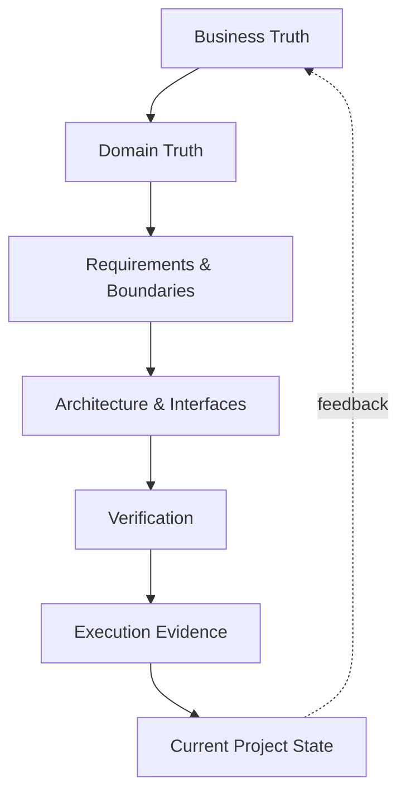

# Knowledge Architecture

## Layers

## Note classes

- **canonical** — owns a concern and resolves conflicts within its jurisdiction.
- **derived** — summarizes canonical truth and links upstream.
- **execution-state** — records verified current reality.
- **decision** — ADR with context, decision and consequences.
- **catalog** — stable identifiers for errors, tests and telemetry.
- **map-of-content** — navigation only.
- **session** — temporal memory; evidence source, not specification authority.

## Retrieval principle

Use the smallest sufficient context path:

`active task → requirement → domain rule → security/external boundary → design/interface → acceptance evidence`

See [[Linking Rules]], [[Metadata Schema]] and [[Source of Truth Map]].
