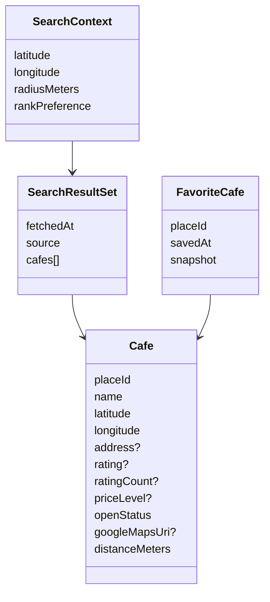

# Cafe Discovery Model

## Core concepts

## Identities

- Provider `placeId` is the stable external identity used to deduplicate and favourite cafes.
- Search result order is not identity.
- Cafe display name is not identity.

## Normalization

Provider responses are normalized at the API/application boundary into Bean Stalker contracts. Optional provider fields remain optional.

## Open status

Canonical vocabulary:
- `OPEN`
- `CLOSED`
- `UNKNOWN`

Never infer `OPEN` merely from the existence of opening-hours data.

## Distance

Distance is a client/domain-derived straight-line estimate from current search center to cafe coordinates. It is **not travel distance** and must not be labeled as driving/walking distance.

See [[Search Lifecycle]], [[Ranking and Filtering Rules]], [[Favorite Cafe Model]] and [[Business Rules]].
