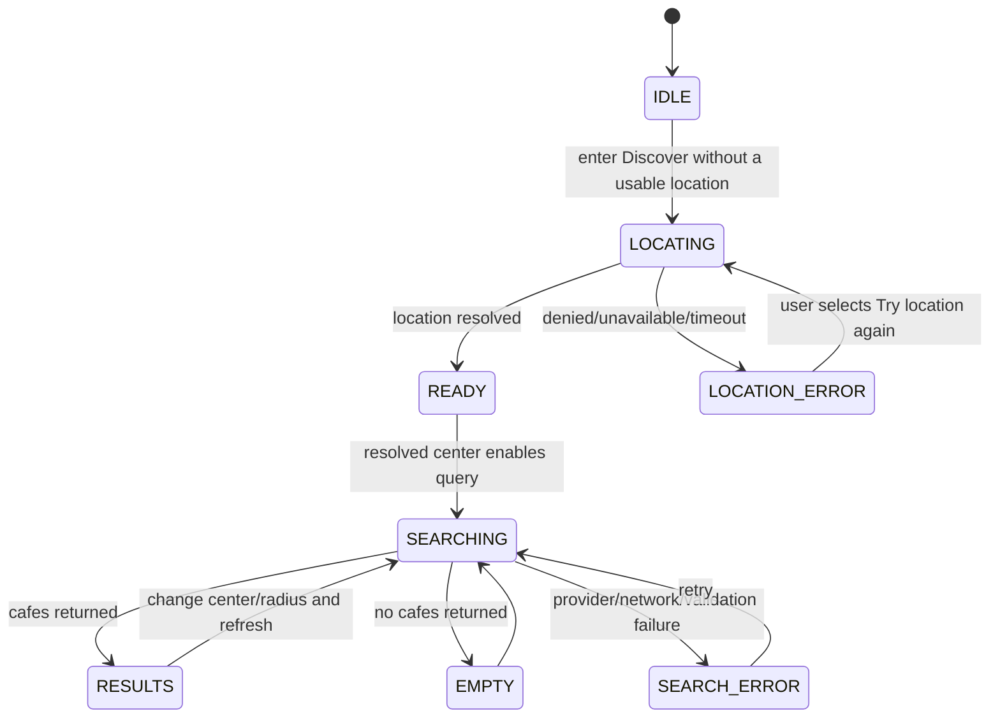

# Search Lifecycle

## Canonical states

## Rules

- Recoverable `LOCATION_ERROR` states expose an explicit, user-triggered location retry; no automatic retry loop is allowed.
- Resolving a center automatically enables the existing TanStack Query search; there is no extra initial Search click.
- A new search request supersedes earlier in-flight presentation; stale responses must not overwrite a newer search.
- `EMPTY` means a successful search returned no matching cafes; it is not an API error.
- `SEARCH_ERROR` must retain enough context to retry safely.
- Cached results may be shown according to [[Search Result Freshness]], but the UI must not misrepresent stale cache as a new successful provider request.

See [[Error Catalog]] and [[UX Contract]].
