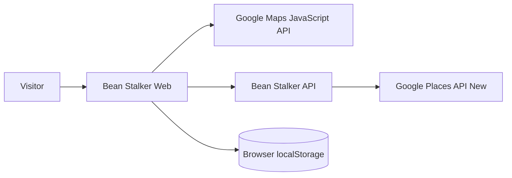

# Software Requirements Specification

## 1. Purpose

This SRS defines observable P0 behaviour for [[MVP Scope]]. Domain meaning comes from [[Cafe Discovery Model]], [[Search Lifecycle]] and [[Business Rules]].

## 2. Actors

### Visitor
Anonymous user of the web application. No account or server-side profile exists in P0.

### Google Maps Platform
External provider supplying map capability, location-selection tooling and Places data. It is not a trusted product actor; responses are validated/normalized at integration boundaries.

## 3. System context

## 4. Primary use cases

### UC-01 Discover cafes from current location
1. Visitor requests current location.
2. Browser returns coordinates or a permission/error outcome.
3. On success the app creates a valid search center.
4. Visitor triggers/accepts cafe search.
5. API validates request, calls provider with bounded parameters/field mask, normalizes results.
6. Web renders list + markers.
7. Visitor can refine results.

### UC-02 Discover cafes from manual location
1. Visitor searches/selects a location.
2. Selected location resolves to coordinates.
3. Same search flow as UC-01 continues.

### UC-03 Save favourites
1. Visitor selects favourite action on a cafe.
2. App stores idempotent local favourite snapshot.
3. Reload preserves it on the same browser/device.
4. Removing favourite updates local state.

### UC-04 Recover from failure
- permission denial → manual location route;
- invalid input → local/API validation message;
- provider/network failure → error state + retry;
- empty result → explicit empty state, not error.

## 5. Functional requirements

Canonical list: [[Functional Requirements]].

## 6. Data requirements

Canonical shapes: [[Data Model]] and `docs/06_INTERFACES/openapi.yaml`.

## 7. Security/privacy requirements

Governed by [[API Key Boundaries]], [[Privacy Boundaries]], [[Threat Model]] and [[Data Handling Policy]].

## 8. External dependency requirements

- provider timeouts/errors mapped to stable Bean Stalker errors;
- production field masks are explicit;
- request radius/result count are server-bounded;
- client cannot provide/override provider credential;
- attribution/provider policy requirements must be respected during UI implementation.

## 9. User interface requirements

Governed by [[UX Contract]] and [[Screen Inventory]].

## 10. Quality requirements

Governed by [[Non-Functional Requirements]], [[Test Strategy]], [[Acceptance Matrix]] and [[Release Readiness]].

## 11. Acceptance

P0 is accepted only when traceable evidence exists in [[Traceability Matrix]] and [[Implementation Handoffs]].
