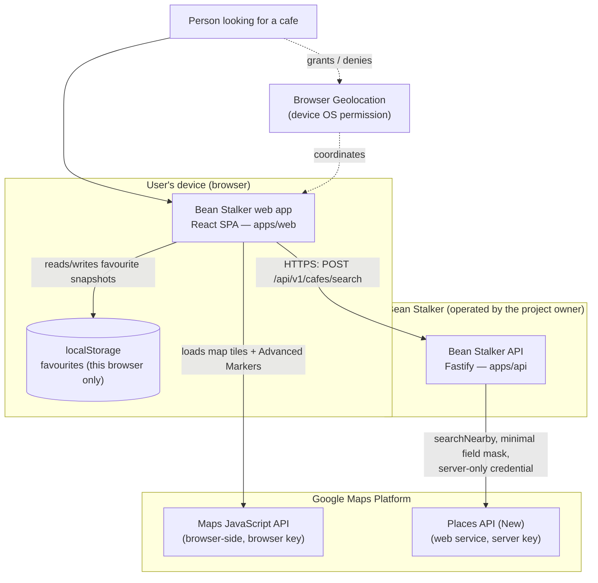
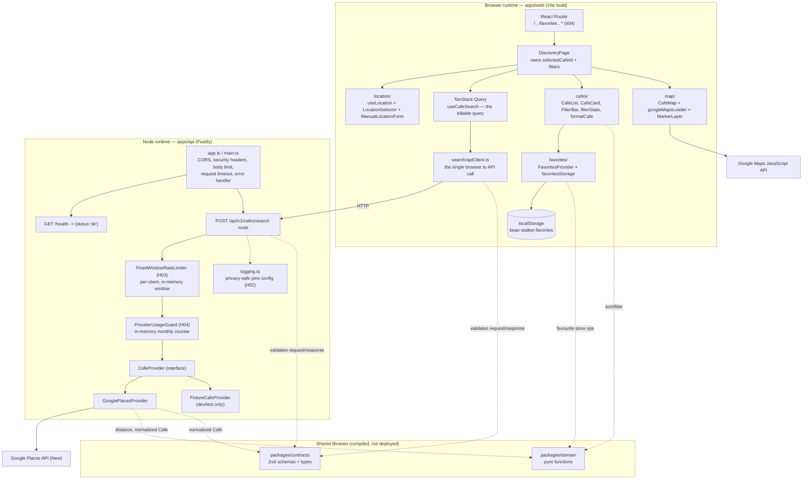
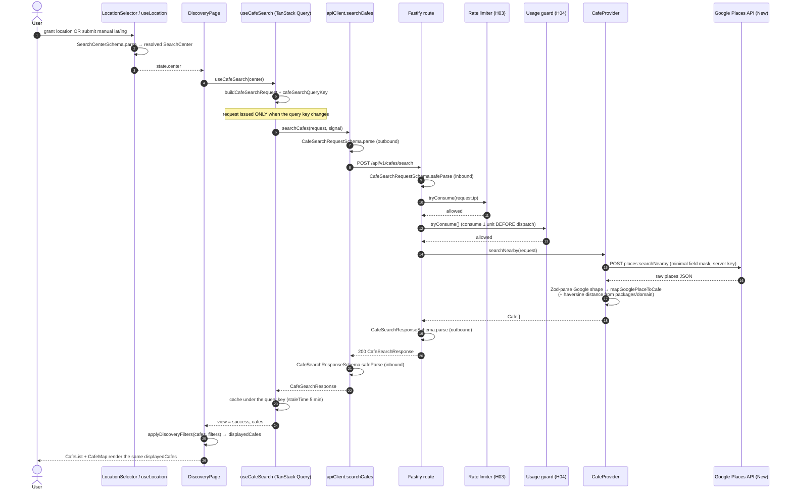
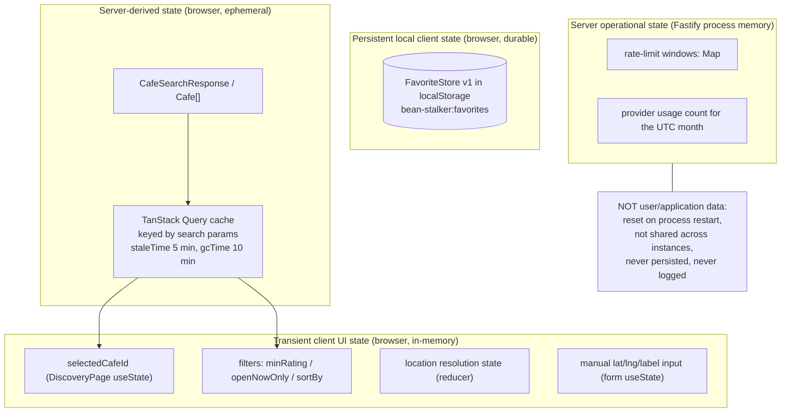
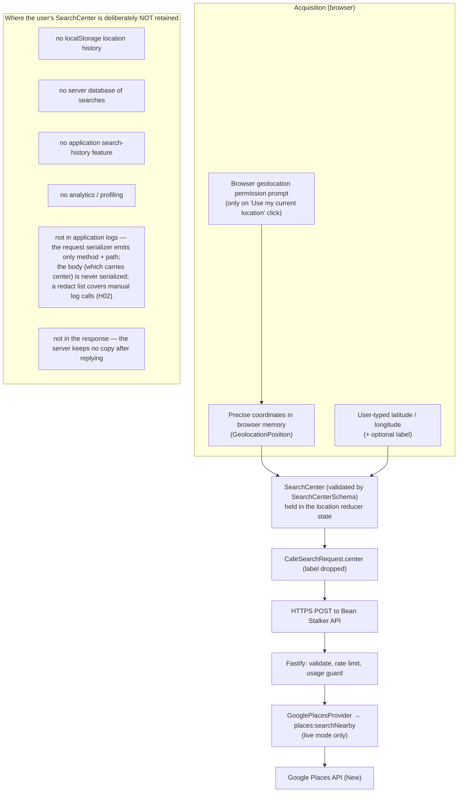
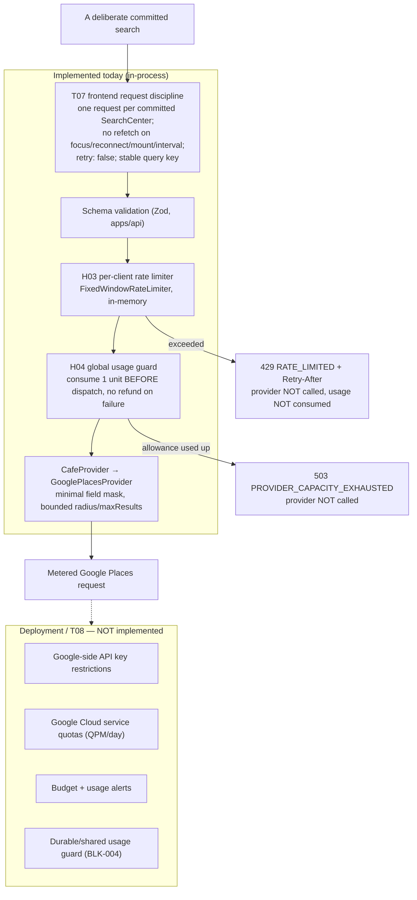
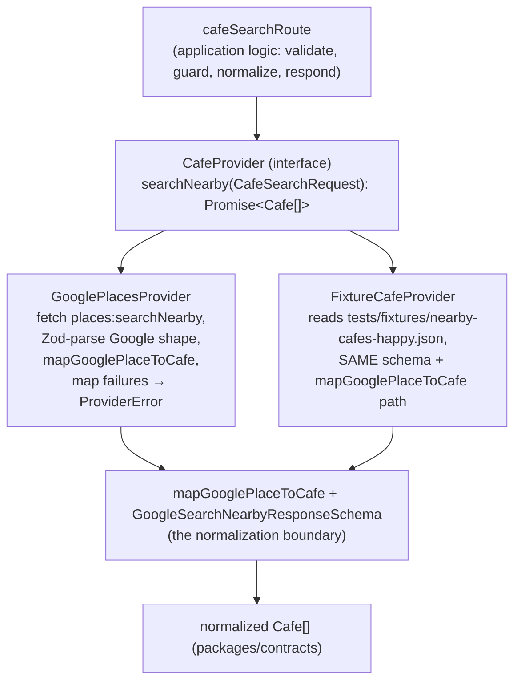

# System Architecture

> **Scope.** This note is the authoritative **as-built** architecture reference
> for Bean Stalker after T00–T07, T09, T10 and hardening milestones H02–H08.
> Every diagram and claim here is verified against repository code, the shared
> contracts, the environment schemas, the accepted ADRs and the tests. Design
> *intent* lives in [[SDD]]; normalized data shapes live in [[Data Model]];
> significant decisions live in the [[Decision Index]]. Where this note and an
> older document disagreed, the discrepancy is listed in §"As-built corrections".

> **As-built, not aspirational.** Nothing below is drawn as "current" unless it
> exists in the repository today. Databases, Redis, queues, a CDN, a reverse
> proxy, user accounts, authentication and cloud infrastructure are **not**
> present — where they are relevant they appear only in §"Future / blocked
> architecture", explicitly labelled.

---

## 1. What runs where (one-paragraph orientation)

Bean Stalker is a **pnpm/TypeScript monorepo** with two runnable apps and two
shared libraries. The **browser** runs a React 19 + Vite SPA (`apps/web`) that
resolves a search location, renders an accessible cafe list and a Google Maps
map, and persists favourites to `localStorage`. A **Node/Fastify service**
(`apps/api`) is the only thing that holds the Google Places **web-service**
credential: it validates each search, applies a per-client rate limit and a
global usage guard, then calls Google Places API (New) `searchNearby` through a
`CafeProvider` adapter and returns a normalized `CafeSearchResponse`. There is
**no database and no user account system** — the only persistence is the
viewer's own browser storage. `packages/contracts` (Zod schemas) and
`packages/domain` (pure functions) are compiled libraries consumed by both apps,
not deployed services.

---

## 2. A — System Context

External actors and systems Bean Stalker interacts with. Fixture/test
infrastructure is **not** shown here — it is a development substitute for the
Google Places provider, not a production dependency (see §8, §"Testing
architecture").



**Boundaries that matter**

- **Maps JavaScript API is browser-side.** The map, tiles and Advanced Markers
  are drawn by Google code running in the page, authenticated with the
  **browser** Maps key + Map ID ([[ADR-002 Google Places Boundary]],
  [[API Key Boundaries]]).
- **Places API (New) is a server-side web service.** Only `apps/api` calls it,
  with the **server-only** `GOOGLE_PLACES_SERVER_KEY`
  ([[ADR-005 Server-Side Places Proxy]]). The browser never holds this key and
  never calls `places.googleapis.com`.
- **Favourites are local client persistence.** They live in one `localStorage`
  key on the viewer's browser. No copy reaches `apps/api` or Google.
- **No user database, no authentication service, no search-history service, no
  analytics/profile service exists.** See §"Non-goals".

---

## 3. B — Container / Runtime Architecture

The runtime components that exist today, and the shared packages they are built
from.



**Frontend modules** (`apps/web/src/`, verified against the tree)

| Directory | Responsibility |
|---|---|
| `components/` | `AppShell` (skip link, landmarks, `FavoritePersistenceNotice`) + `Header` (two nav links). |
| `location/` | Current + manual search-centre acquisition: `locationState` (reducer), `useLocation`, `browserGeolocation` (the only `navigator.geolocation` touch), `geolocationErrors`, `LocationSelector`, `ManualLocationForm`. |
| `search/` | `apiClient` (the single browser→API boundary), `searchRequest` (SearchCenter→request + query key), `useCafeSearch` (cost-safe TanStack Query hook), `errorCopy`. |
| `cafes/` | `CafeList`/`CafeCard`/`CafeSummary` (the accessible primary surface), `SearchStatePanel`, `FilterBar` + `filterState` (local sort/filter, delegating to `packages/domain`), `formatCafe`. |
| `map/` | `CafeMap` (owns one `google.maps.Map`), `googleMapsLoader` (promise-deduped script loader), `markerLayer` (imperative, non-React marker owner). |
| `favorites/` | `FavoritesProvider` (persistent local state), `favoritesStorage` (the one `localStorage` key owner), `useFavorites`, `FavoriteButton`, `FavoritePersistenceNotice`. |
| `routes/` | `DiscoveryPage`, `FavoritesPage`, `NotFoundPage`. |
| `styles/` | `app.css` — one stylesheet, CSS custom properties, no CSS framework. |

**Backend modules** (`apps/api/src/`)

| File(s) | Responsibility |
|---|---|
| `main.ts` | Loads + validates env, selects provider + usage guard by `CAFE_PROVIDER`, builds the app, handles SIGINT/SIGTERM. |
| `app.ts` | `buildApp(...)` — Fastify instance with `bodyLimit`/`requestTimeout`, `@fastify/cors` (single origin), `registerSecurity`, canonical `setErrorHandler`, route registration. |
| `security.ts` | `registerSecurity` — `onSend` security-header hook, `setNotFoundHandler` → canonical `NOT_FOUND` (H07). |
| `routes/health.ts` | `GET /health` → `{status:'ok'}`. |
| `routes/cafeSearch.ts` | `POST /api/v1/cafes/search` — validate → rate limit → usage guard → provider → normalize → respond. |
| `rateLimiter.ts` | `FixedWindowRateLimiter` — per-client, injectable clock, in-memory (H03). |
| `providerUsageGuard.ts` | `ProviderUsageGuard` interface + `InMemoryProviderUsageGuard` + `UnlimitedProviderUsageGuard` (H04). |
| `providers/cafeProvider.ts` | The `CafeProvider` interface (`searchNearby`). |
| `providers/google-places/` | `GooglePlacesProvider`, non-strict Google response schemas, `mapGooglePlaceToCafe`. |
| `providers/fixtureCafeProvider.ts` | `FixtureCafeProvider` — dev/test only. |
| `providers/providerError.ts` | `ProviderError` (bounded provider failure taxonomy). |
| `logging.ts` | `buildLoggerOptions` — privacy-safe pino serializers + redact list (H02). |
| `env.ts` | `loadServerEnv` — Zod env schema, fail-closed `live` refinement. |

**Dependency direction** (unchanged intent, [[SDD]])

```text
UI / HTTP adapters
      |
Application orchestration (routes, hooks)
      |
Domain helpers + shared contracts
      |
Provider / storage adapters
```

`packages/contracts` and `packages/domain` are **compiled workspace libraries**
(`workspace:*` dependencies, built by a root `postinstall`/`predev` hook). They
are imported into the `apps/web` bundle and the `apps/api` process — they are
**not** separately deployed services and have no network surface.

---

## 4. Deployment topology — unresolved / future

**Bean Stalker has no deployed production environment.** The current runtime is
local development (`pnpm dev`) or CI. The following are **open deployment-phase
questions**, not current architecture:

- whether `apps/web` and `apps/api` are served **same-origin** (reverse proxy /
  one host) or on **separate hostnames** — this determines whether CORS is
  exercised in production at all and what `WEB_ORIGIN` / `VITE_API_BASE_URL`
  contain;
- the reverse-proxy / load-balancer topology, and therefore the correct
  `trustProxy` setting and trusted-hop configuration before `request.ip` can be
  trusted for the per-client rate limiter ([[Known Blockers|BLK-003]],
  [[ADR-009 API Security Posture]] §5);
- HTTPS termination and HSTS (set by the host/proxy, not application code);
- the hosting vendor / platform ([[Known Blockers|BLK-002]]);
- a **durable / shared** implementation of `ProviderUsageGuard`, or an
  equivalent infrastructure hard cap (Google Cloud quota + budget)
  ([[Known Blockers|BLK-004]]).

H09 does **not** resolve any of these. They are recorded so a future reader does
not mistake an omission for an undocumented decision.

---

## 5. C — Cafe search sequence (successful committed search)

The path of one deliberate search, from a committed `SearchCenter` to rendered
results. `apps/web` never calls Google Places directly; `apps/api` is the only
holder of the web-service key.



**Cost behaviour after results are on screen** (RM0 —
[[ADR-007 Cost-Safe Search Orchestration]], [[Non-Functional Requirements|NFR-009]]):
changing a **filter**, changing the **sort**, toggling **Open now**, **selecting**
a cafe (card or marker), **panning/zooming** the map, or navigating to
**/favorites** and back all operate on the already-cached `Cafe[]`. None of them
changes the query key, so **each issues zero `POST /api/v1/cafes/search` and zero
Google requests**. This is enforced by `useCafeSearch.test.tsx`,
`search.spec.ts`, `filters.spec.ts`, `favorites.spec.ts` and `mobile.spec.ts`.

A **Retry** after a failure is the only user-triggered re-request, and it is a
single explicit `query.refetch()` — never automatic (`retry: false`).

### Search failure branches (companion table)

| Condition | HTTP | Envelope code | Rate limit consumed? | Usage unit consumed? | Provider called? |
|---|---:|---|---|---|---|
| Malformed / out-of-bounds / unparseable body | 400 | `VALIDATION_ERROR` | no | no | no |
| Body over 16 KiB (`bodyLimit`, rejected in parsing) | 413 | `VALIDATION_ERROR` | no | no | no |
| Unknown route / unsupported method | 404 | `NOT_FOUND` | no | no | no |
| This client over the per-client window (H03) | 429 | `RATE_LIMITED` (+ `Retry-After`) | — (this *is* the limiter) | no | no |
| Global monthly allowance exhausted (H04) | 503 | `PROVIDER_CAPACITY_EXHAUSTED` | yes | no (guard rejects first) | no |
| Provider timeout / network / 5xx | 503 | `PROVIDER_UNAVAILABLE` | yes | **yes — not refunded** | yes (attempted) |
| Provider 401/403 | 502 | `PROVIDER_AUTH_ERROR` | yes | **yes — not refunded** | yes (attempted) |
| Provider 429 | 503 | `PROVIDER_RATE_LIMITED` | yes | **yes — not refunded** | yes (attempted) |
| Provider returned an unexpected shape / non-JSON | 502 | `PROVIDER_BAD_RESPONSE` | yes | **yes — not refunded** | yes (attempted) |
| Unexpected server error | 500 | `INTERNAL_ERROR` | depends where it threw | depends | depends |
| Browser aborted the fetch (superseded search) | — | `REQUEST_ABORTED` (client-only) | n/a | n/a | n/a |

Full definitions and user-facing treatment: [[Error Catalog]]. The client never
receives a stack trace, a filesystem path, the route pattern, the rate-limit
internals, the usage counter or the monthly cap value ([[Threat Model]] T-11).

---

## 6. D — State ownership

Bean Stalker has four distinct kinds of state. Confusing them is the most common
way to misread the architecture.



| Category | Where it lives | Lifetime | Notes |
|---|---|---|---|
| **Server-derived** | TanStack Query cache in the browser | 5 min fresh / 10 min GC / tab close | `CafeSearchResponse` and its `Cafe[]`. Not stored in any global client store ([[ADR-006 TanStack Query Server State]]). The **server keeps no copy** after the response is sent. |
| **Transient UI** | React `useState` / `useReducer` in the browser | until re-render / navigation / tab close | `selectedCafeId`, `filters`, `LocationState`, manual-input fields. Never persisted, never sent to `apps/api`. |
| **Persistent local** | one `localStorage` key on the viewer's browser | until the user clears it | `FavoriteStore` (`{version:1, cafes:[{placeId, savedAt, snapshot:Cafe}]}`). Private to that browser; never synced. |
| **Server operational** | Fastify process memory | current rate-limit window / current UTC month; **lost on restart** | Rate-limit window counters, the in-memory monthly provider-usage count. **Not user data** — see below. |

### The backend is stateless with respect to users

`apps/api` holds **no user sessions, no profiles, no favourites and no search
history**. It is stateless in the sense that matters for users: any instance can
serve any request, nothing about a person is remembered between requests, and
restarting the process loses nothing a user would notice.

This is **not** because "it has no database" — it is a deliberate scope decision
([[ADR-004 Favorites Local Storage]], [[MVP Scope]]). The rate-limit window
counters and the in-memory monthly usage count **are** in-process state, but they
are **operational** state (abuse/cost control), not user or session persistence.
A future durable/shared `ProviderUsageGuard` ([[Known Blockers|BLK-004]]) would
move that operational counter into a shared store — it would **not** make the
application session-stateful or introduce user data.

**There is no server-side user database in the MVP.**

---

## 7. E — Location data lifecycle

How a search location is acquired, used and disposed of. Two acquisition paths
feed the **same** downstream pipeline.



**Retention today**

- The user's `SearchCenter` exists in **browser memory** for the life of the
  page (in the location reducer state and inside the TanStack Query key/cache
  entry). It is **not** written to `localStorage`.
- On the wire it travels once, over HTTPS, in the `POST` body to `apps/api`.
- `apps/api` uses it to build the provider request and to echo `searchCenter`
  in the response, then **discards it** — no store, no log
  ([[Privacy Boundaries]], [[Data Handling Policy]], H02).

### `SearchCenter` vs. a saved cafe's coordinates — not the same thing

A `FavoriteRecord.snapshot` contains `location: {latitude, longitude}` — but that
is the **cafe's** public place location, not the user's. Saving a favourite
persists a public place's coordinates; it does **not** persist where the user
was when they searched. [[Privacy Boundaries]] makes this distinction explicit.

### Third-party privacy boundary (do not overstate)

When `CAFE_PROVIDER=live`, Google Places **necessarily receives the search
coordinates** — nearby discovery cannot happen otherwise. Bean Stalker
**minimises retention** of the user's location (no history, no DB, no
coordinate logging); it does **not** eliminate the necessary transmission to the
provider. Any user-facing or portfolio copy must not claim "your location never
leaves your device".

---

## 8. F — Cost & abuse guardrail flow

The complete, currently-implemented protection stack for the metered provider,
plus the controls that are still deployment-phase.



**Properties that hold today** ([[ADR-008 Metered Provider Cost Controls]],
[[API Cost Guardrail Runbook]]):

- The frontend never auto-retries and never re-requests on filter / sort /
  selection / map pan-zoom / favourite / route change.
- Validation, rate-limit and usage-guard rejections **never reach the provider**.
- One allowance unit is consumed **immediately before** provider dispatch and is
  **not refunded** if the provider then fails — conservative, fail-closed
  accounting.
- `CAFE_PROVIDER=live` **cannot start** without `GOOGLE_PLACES_SERVER_KEY` **and**
  `PROVIDER_MONTHLY_REQUEST_LIMIT` (fail-closed env validation, ADR-009 §2).
- `CAFE_PROVIDER=fixture` uses `UnlimitedProviderUsageGuard` — local dev is never
  blocked and fixture traffic is never implied to cost money.

**Honest limitation:** the in-memory `InMemoryProviderUsageGuard` resets on
process restart and is not shared across instances. **It is not a production
financial hard cap.** Public release stays blocked on a durable/shared
implementation *or* an equivalent Google-side quota+budget hard guard
([[Known Blockers|BLK-004]]). The Google-side controls (API restrictions, QPM /
daily quotas, budget alerts) are **deployment / T08** work, not implemented
application behaviour.

---

## 9. G — Cafe provider abstraction



**Why the boundary exists** ([[ADR-002 Google Places Boundary]],
[[ADR-007 Cost-Safe Search Orchestration]]):

- **Deterministic tests** — `FixtureCafeProvider` and injected fakes let the
  whole suite run with no network and no credentials.
- **RM0 development** — `pnpm dev` with `CAFE_PROVIDER=fixture` exercises the
  *real* API + normalization with zero billable traffic.
- **Provider isolation** — Google's raw request/response shapes stay inside
  `providers/google-places/`; the rest of the system only sees `Cafe`.
- **Normalization in one place** — both providers go through the same
  `GoogleSearchNearbyResponseSchema` + `mapGooglePlaceToCafe`, so fixture data
  and live data are shaped identically (including `distanceMeters`, computed via
  `packages/domain`'s Haversine helper against the real request centre).

**Honest portability limits — Bean Stalker is not provider-neutral:**

- `FixtureCafeProvider` consumes a **Google-shaped** fixture and reuses the
  **Google** response schema and mapper — it is a Google stand-in, not a neutral
  second provider.
- `openStatus` is derived from Google's `currentOpeningHours.openNow`; `Cafe`
  fields (`priceLevel` as an opaque string, `businessStatus`, `googleMapsUri`,
  `placeId`) mirror Google's model.
- The field mask, `includedTypes: ['cafe']` and the `rankPreference` enum
  (`POPULARITY | DISTANCE`) are Google Places concepts surfaced in the contract.

A genuine second provider (`PRD-10`, [[Productionization Program]]) would need
its own mapper and would likely force contract changes. The current boundary
buys **testability and isolation**, not drop-in provider replacement.

---

## 10. Shared contract boundary — `packages/contracts`

One Zod schema module, consumed by both apps, mirrored by `openapi.yaml`
([[API Contract]], [[Data Model]]).

| Export | Used at |
|---|---|
| `SearchCenterSchema` / `LatLngSchema` | browser location validation; request `center` |
| `CafeSchema` | provider normalization output; favourite snapshots |
| `CafeSearchRequestSchema` / `CafeSearchResponseSchema` | **both** sides of the HTTP call (outbound + inbound, on the browser **and** the server) |
| `ErrorEnvelopeSchema` / `ErrorCodeSchema` | the API's failure envelope; the browser's error parsing |
| `FavoriteStoreSchema` / `FavoriteRecordSchema` | `localStorage` read/write validation |
| `HttpOriginSchema` | `WEB_ORIGIN` (api env) and `VITE_API_BASE_URL` (web env) |
| `formatValidationError` | consistent `field: reason` messages, never echoing values |
| `CAFE_SEARCH_BOUNDS` | shared radius (100–5000 m) / maxResults (1–20) bounds |

**TypeScript** gives compile-time structure; **Zod** enforces the same shape at
**runtime** at every trust boundary — the browser↔API hop (both directions),
`localStorage`, and the environment. TypeScript casts are deliberately **not
trusted** at these boundaries (`apiClient.ts`, `cafeSearch.ts`,
`favoritesStorage.ts` all `safeParse`).

---

## 11. Shared domain boundary — `packages/domain`

Pure, framework-free functions with no React, Fastify, Google or I/O
dependencies.

| Export | Responsibility | Consumed by |
|---|---|---|
| `haversineDistanceMeters` | straight-line distance, search centre → cafe | `apps/api` mapper (T05) |
| `sortCafes` | `DISTANCE` / `RATING` ordering (rating tie-break: count desc → distance asc, [[Open Questions|OQ-008]]) | `apps/web` `filterState` (T09) |
| `filterCafes` | `minRating` (positive threshold excludes unrated) + `openNow` (`UNKNOWN` ≠ open) | `apps/web` `filterState` (T09) |
| `EMPTY_FAVORITE_STORE` / `isFavorite` / `addFavorite` / `removeFavorite` | immutable `FavoriteStore` operations | `apps/web` `FavoritesProvider` / `favoritesStorage` (T10) |

**Why separated:** ranking, filtering, distance and favourite-store rules are
domain behaviour with precise invariants ([[Ranking and Filtering Rules]],
[[Business Rules]], [[Favorite Cafe Model]]). Keeping them pure makes them
exhaustively unit-testable and lets **both** runtimes reuse the *same* distance
formula (no duplicated maths between client and server). This is a **separation
of concerns**, not a claim of full Domain-Driven Design — there are no
aggregates, repositories or a ubiquitous-language model layer.

---

## 12. Search query / cache architecture (TanStack Query)

`useCafeSearch(center)` is the only billable query. Verified settings
(`apps/web/src/search/useCafeSearch.ts`, `searchRequest.ts`):

```text
queryKey  = ['cafes','search', latitude, longitude, radiusMeters, maxResults, rankPreference]
            (coordinates NOT rounded; local filters/sort are NOT in the key)
enabled   = a resolved SearchCenter exists
staleTime = 5 min      gcTime = 10 min
retry               = false
refetchOnWindowFocus = false
refetchOnReconnect   = false
refetchOnMount       = false
refetchInterval      = false
```

The request parameters are fixed defaults today (`radiusMeters: 2000`,
`maxResults: 10`, `rankPreference: 'DISTANCE'` — `CAFE_SEARCH_DEFAULTS`);
there is no user-facing radius/rank control ([[Open Questions|OQ-011]]).

**Why local filters/sort are excluded from the query key:** they transform the
already-fetched `Cafe[]` in the browser (`applyDiscoveryFilters` →
`packages/domain`). Putting them in the key would evict the cache entry and
issue a new **billable** provider request on every filter tweak — exactly the
amplification RM0 forbids ([[ADR-007 Cost-Safe Search Orchestration]]).

---

## 13. Selection synchronization (list ↔ map)

`selectedCafeId` is **shared transient UI state** owned by `DiscoveryPage`.

- Both `CafeList` and `CafeMap` receive the *same* `displayedCafes` and the
  *same* `selectedCafeId` — neither holds its own copy.
- Clicking a card **or** a marker calls the same `onSelectCafe`; the other
  surface reflects it (card gets `aria-pressed` + a visible "Selected" flag;
  the marker restyles and the map `panTo`s once per genuine change).
- Selection is **reconciled by render-derivation**, not an effect: a
  `selectedCafeId` that is not in the currently displayed set reads as "none",
  and a filter change that hides the selected cafe drops the selection
  permanently.
- **Accessibility invariant (H08 / [[UX Contract]]):** the `CafeList` is the
  **primary accessible interaction surface**. Every essential action — select,
  open the Google Maps link, favourite, filter, sort — is a list/DOM control.
  Marker interaction is an **enhancement**; nothing requires it. When the Maps
  script fails, the list, filters and favourites stay fully usable
  (`search.spec.ts`).

---

## 14. Favourite architecture

`apps/web/src/favorites/` + `packages/domain` favourites helpers +
`FavoriteStoreSchema`.

```text
FavoriteStore v1 = { version: 1, cafes: FavoriteRecord[] }
FavoriteRecord   = { placeId, savedAt (ISO), snapshot: Cafe }
```

- **One key owner.** `favoritesStorage.ts` is the only module that touches
  `localStorage['bean-stalker:favorites']`. Everything else goes through
  `FavoritesProvider` / `useFavorites`.
- **Untrusted read.** `readFavoriteStore()` treats storage as hostile input:
  missing key, unparseable JSON, wrong shape, or an unsupported `version` all
  degrade to `EMPTY_FAVORITE_STORE`. A bad read is **never** rewritten — recovery
  only happens on the next real mutation ([[Local State Recovery Runbook]],
  [[Threat Model]] T-07).
- **Persist-then-commit.** `FavoritesProvider.commit()` calls
  `writeFavoriteStore()` first and only updates React state (and clears the
  error flag) **if the write returned `{ok:true}`**. A failed write surfaces
  `FavoritePersistenceNotice` (a bounded `role="alert"`) and the UI does **not**
  claim the favourite is saved.
- **Hydrate once.** A lazy `useState` initializer reads storage a single time —
  no effect, no per-render parse, no flicker.
- **No server, no account, no sync.** `apps/api` and Google never see
  favourites. There is no TanStack Query wrapper (favourites are local
  *persistent* state, not server state). `/favorites` renders snapshots only —
  it does **not** re-query the provider.
- **Saved distance is not shown.** `CafeSummary` renders with `showDistance={false}`
  on `/favorites`: a snapshot's `distanceMeters` is relative to a past search
  centre and has no meaningful reference point later.

---

## 15. Error architecture

Every failure the API returns uses the **one** canonical envelope
(`{ error: { code, message, requestId } }`). Codes are the stable
[[Error Catalog]] enum in `packages/contracts`.

| Layer | Mechanism | Guarantees |
|---|---|---|
| Route validation | `CafeSearchRequestSchema.safeParse` → 400 | `formatValidationError` never echoes the offending value |
| Body limit / parse | Fastify parsing → `setErrorHandler` `<500` branch → 413/400 `VALIDATION_ERROR` | no framework message, path, or the limit value |
| Unknown route / method | `setNotFoundHandler` → 404 `NOT_FOUND` | no route pattern leaked (Fastify's default would) |
| Rate limit (H03) | `FixedWindowRateLimiter` → 429 `RATE_LIMITED` + `Retry-After` | no IP, no window internals |
| Usage guard (H04) | `ProviderUsageGuard` → 503 `PROVIDER_CAPACITY_EXHAUSTED` | no counter, no cap value, no pricing |
| Provider failure | `ProviderError` → 502/503 by code | raw Google body / status / key never surfaced |
| Anything else | `setErrorHandler` `>=500` → 500 `INTERNAL_ERROR` | generic message; the H02 `err` serializer drops attached props before logging |
| Browser transport | `apiClient` → typed `CafeSearchError`; `AbortError` passed through | no `Response`, no stack, no provider payload reaches the UI |

Full HTTP mapping and user treatment: **[[Error Catalog]]** (authoritative — not
duplicated here).

---

## 16. Security architecture summary

Architecture-level view; the decisions and rationale are
[[ADR-009 API Security Posture]] and [[Threat Model]], the env detail is
[[Environment Contract]], the key split is [[API Key Boundaries]].

| Control | Where | Note |
|---|---|---|
| Runtime request validation | `packages/contracts` Zod at every boundary | casts not trusted |
| Server-secret boundary | only `apps/api` holds `GOOGLE_PLACES_SERVER_KEY`; never `VITE_`-prefixed | [[ADR-005 Server-Side Places Proxy]] |
| Frontend build secret gate | `scripts/check-frontend-dist-secrets.mjs` in `apps/web` `build` | fails the build on a server-only marker in `dist/` |
| Fail-closed live config | env `superRefine` gated on `CAFE_PROVIDER=live` | live cannot start without key + monthly limit |
| Origin validation | `HttpOriginSchema` on `WEB_ORIGIN` / `VITE_API_BASE_URL` | bare origin only |
| CORS | `@fastify/cors` with a **single string origin** | never reflects an arbitrary `Origin`; a browser control, not a boundary vs. direct HTTP clients |
| Security headers | `onSend` hook: `X-Content-Type-Options: nosniff`, `Referrer-Policy: no-referrer`, `X-Frame-Options: DENY` | CSP/HSTS/Permissions-Policy deliberately omitted (page/deploy concerns) |
| Body limit | `bodyLimit: 16 KiB` | over-limit rejected **before** rate limiter / guard / provider |
| Request timeout | `requestTimeout: 20 s` | above the 10 s outbound provider timeout |
| Privacy-safe logging | `logging.ts` pino serializers + redact list | no IP, no coordinates, no body, no credentials, no raw provider payloads |
| Error sanitization | `setErrorHandler` / `setNotFoundHandler` | canonical envelope only; bounded generic message |
| Rate limiting (H03) | `FixedWindowRateLimiter` per client | `request.ip` used only as an ephemeral key |
| Usage guarding (H04) | `ProviderUsageGuard` | consume-before-dispatch, no refund; **not** a production hard cap (BLK-004) |
| Minimal health endpoint | `GET /health` → `{status:'ok'}` | no env, keys, counters or build info |
| `trustProxy` | left `false` | deployment must define the trusted hop (BLK-003) |
| **Not present** | no auth, sessions, JWT, CSRF machinery, OAuth, captcha, WAF, IDS, DB encryption | Bean Stalker has none of the systems those defend ([[Threat Model]] "Out of scope") |

---

## 17. Testing architecture

| Layer | Tooling | What it covers | Provider used |
|---|---|---|---|
| Unit | Vitest | distance, sort/filter, favourite store ops, Google response mapper, env schema, rate limiter, usage guard, error copy | none / pure |
| Component | Vitest + React Testing Library | location outcomes, search-state panel, cafe card missing-field handling, filter/reset, favourite toggle + persistence, map lifecycle (mocked `google.maps`) | injected fake / mocked |
| API integration | Vitest + `app.inject` | request validation, the pipeline (rate limit → guard → provider), provider error mapping, logging privacy, security headers / CORS / body limit / `NOT_FOUND` | injected `CafeProvider` fake / `InMemoryProviderUsageGuard` |
| End-to-end | Playwright (headless Chromium) | discovery journey, filters, favourites, capacity 429/503, location denied, mobile 320 px + keyboard | `page.route` fakes the API; `maps.googleapis.com` is `route.abort()`ed |
| Accessibility | `@axe-core/playwright` (dev-only) | zero-violation scan of 9 representative states (`.cafe-map__surface` excluded — third-party) | as e2e |

**Fixture vs. mock vs. `FixtureCafeProvider`:**

- **Fixture data** = committed JSON (`tests/fixtures/nearby-cafes-*.json` are
  Google-shaped raw responses; `cafe-search-response-*.json` are Bean
  Stalker-shaped) — deterministic, repeatable edge cases, no live dependency.
- **Mock behaviour** = a test double injected for one test (e.g.
  `vi.fn().mockRejectedValue(...)` as the `CafeProvider`, or Playwright
  `page.route` intercepting the HTTP call).
- **`FixtureCafeProvider`** = a *real, shipped* `apps/api` provider selected by
  `CAFE_PROVIDER=fixture` that serves the happy fixture through the real
  normalization path — used by `pnpm dev` and available in CI, so "real Bean
  Stalker API + fake provider" can be exercised end to end with **zero** Google
  traffic.

Required gates ([[Test Strategy]], [[Definition of Done]]):
`node scripts/validate-brain.mjs`, `pnpm lint`, `pnpm format`, `pnpm typecheck`,
`pnpm test`, `pnpm build`, `pnpm e2e`.

---

## 18. Non-goals — not in the current MVP architecture

Verified absent from the repository. Listed so a future reader does not mistake
an omission for undocumented architecture.

- **No account system, no authentication, no authorization, no login.**
- **No server-side user database** (no SQL/NoSQL store of any kind).
- **No server-side favourites, no cloud sync, no multi-device state.**
- **No search-history / recent-searches feature or store.**
- **No reviews, photos, or user-generated content.**
- **No group rendezvous / meeting-point feature** (post-MVP idea only).
- **No native mobile app, no React Native, no Capacitor.**
- **No PWA manifest, no service worker, no offline mode.**
- **No Redis / message queue / background worker.**
- **No CDN, load balancer, reverse proxy, or Kubernetes in the current
  runtime.**
- **No production deployment topology** — see §4.
- **No analytics, telemetry pipeline, or metrics dashboard** (the
  [[Telemetry Event Catalog]] is a spec, not an implementation).

---

## 19. Future / blocked architecture (governed, not implemented)

Only items that already have a governed home. **All unimplemented.**

| Item | Status | Governed by |
|---|---|---|
| Durable / shared `ProviderUsageGuard` (or infra hard cap) | **blocked — required before public release** | [[Known Blockers|BLK-004]], [[ADR-008 Metered Provider Cost Controls]] |
| Production reverse-proxy / hostname topology + `trustProxy` + HSTS | **unresolved — deployment phase** | [[Known Blockers|BLK-003]], [[Known Blockers|BLK-002]], [[ADR-009 API Security Posture]] |
| Google-side key restrictions, service quotas, budget alerts, real Map ID | **unresolved — Google Cloud / T08** | [[Known Blockers|BLK-001]], [[Known Blockers|BLK-003]] |
| Live provider smoke (first real `searchNearby`) | **blocked** | `T08`, [[Task Status]] |
| CI workflow, metrics dashboard, PWA, photos, recent searches, shareable searches, cloud favourites/accounts, a database, a second provider | **uncommitted — post-MVP** | [[Productionization Program]] (`PRD-01…PRD-10`) |

These **must not** be drawn into §2–§9.

---

## 20. As-built corrections (this revision)

Discrepancies found while verifying v1.0 against code, and resolved here
(v1.0 → v2.0; [[Source of Truth Map]] rank 8 authority):

| v1.0 said | Code actually does | Resolution |
|---|---|---|
| Frontend modules include `filters` and `shell` | No `filters/` or `shell/` directory exists — filtering/sorting live in `cafes/filterState.ts` + `FilterBar.tsx` (delegating to `packages/domain`); the shell is `components/AppShell.tsx` + `Header.tsx` | Module table in §3 corrected to the real directory structure |
| Backend module `observability` | Implemented as `logging.ts` (`buildLoggerOptions`) | §3 names the real file |
| Backend module `errors` | Error handling is `app.ts` `setErrorHandler` + `security.ts` `setNotFoundHandler` + `providers/providerError.ts` + per-route mapping | §3 / §15 describe the real mechanism |
| Single context diagram with `packages/contracts` as an API dependency node | Contracts is a compiled library imported into both runtimes, not a runtime dependency of the API in the network sense | §2 shows only external systems; §3 shows shared libraries as compiled, non-deployed |
| No explicit statement of state categories or the stateless-backend nuance | Four distinct state categories exist; "stateless" is about users, not "no database" | New §6 |

No **code** changed in H09 — these are documentation corrections only.

---

## 21. Traceability

- **Requirements:** [[Functional Requirements]], [[Non-Functional Requirements]]
  (RM0 / NFR-009 → §5, §8; NFR-004/005 → §13; NFR-002 → §7; NFR-006 → §15).
- **Decisions:** [[Decision Index]] — ADR-002 (§9), ADR-004 (§6, §14),
  ADR-005 (§2, §16), ADR-006 (§6, §12), ADR-007 (§5, §12), ADR-008 (§8),
  ADR-009 (§16).
- **Interfaces:** `openapi.yaml`, [[API Contract]], [[Error Catalog]] (§15),
  [[UX Contract]] (§13).
- **Boundaries:** [[API Key Boundaries]], [[Privacy Boundaries]] (§7),
  [[External Service Constraints]], [[Data Handling Policy]].
- **Operations:** [[Environment Contract]] (§16), [[API Cost Guardrail Runbook]]
  (§8), [[Observability Runbook]], [[Local Development Runbook]] (§9, §17),
  [[Production Deployment Runbook]] (§4), [[Local State Recovery Runbook]] (§14).
- **Verification:** [[Test Strategy]] (§17), [[Traceability Matrix]],
  [[Acceptance Matrix]].
- **Execution state:** [[Current Project State]], [[Task Status]],
  [[Implementation Handoffs]], [[Known Blockers]], [[Open Questions]].

## 22. Revision history

- **v2.0 (2026-09-03, H09):** rewritten as the comprehensive as-built
  architecture reference — seven verified views (context, container, search
  sequence, state ownership, location lifecycle, cost/abuse guardrails, provider
  abstraction), plus shared-package boundaries, query/cache, selection sync,
  favourites, error, security and testing architecture, explicit non-goals, a
  labelled future/blocked section, and the as-built corrections in §20.
- **v1.0 (2026-08-27):** initial P0 baseline sketch.
