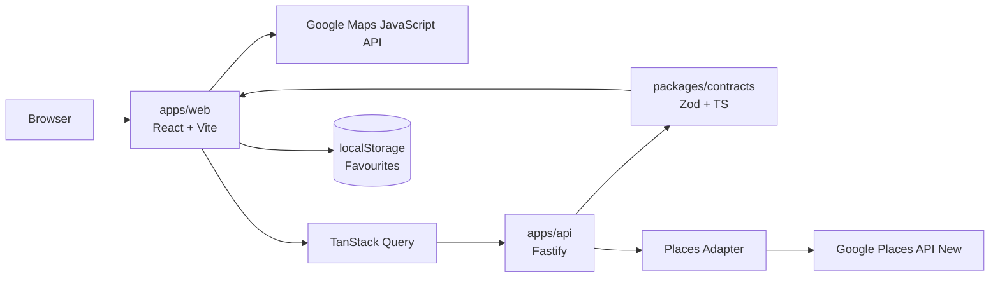

# System Architecture

## P0 baseline

Bean Stalker uses a small TypeScript workspace with a React web client and a Fastify backend boundary for Places web-service calls.



## Frontend modules

- `location` — current/manual search-center acquisition;
- `search` — query inputs and result orchestration;
- `map` — map and marker presentation;
- `cafes` — normalized cafe cards/details;
- `filters` — deterministic local filtering/sorting;
- `favorites` — local persistence;
- `shell` — responsive layout/routes/error boundaries.

## Backend modules

- `health` — process health;
- `cafe-search` — input validation and application service;
- `providers/google-places` — provider request/response adapter;
- `errors` — stable external error mapping;
- `observability` — correlation/logging.

## Dependency direction

```text
UI / HTTP adapters
      ↓
Application orchestration
      ↓
Domain helpers + shared contracts
      ↓
Provider/storage adapters
```

## Cross-cutting controls

- separate browser/server credentials;
- Zod validation at trust boundaries;
- bounded provider request parameters;
- minimal field masks;
- request cancellation/newer-query protection;
- safe logging;
- explicit error states.

See [[Decision Index]].
