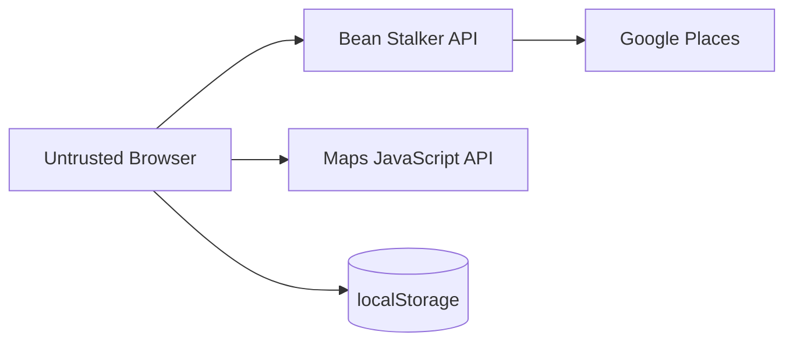

# Threat Model

## Assets

- server-side Google Places credential;
- browser credential quota/billing exposure;
- user precise location during active search;
- availability/cost budget of external API;
- integrity of cafe information presented to user.

## Trust boundaries

## Threats and controls

### T-01 server key leakage
Controls: server-only env secret (only `GOOGLE_PLACES_SERVER_KEY`, `optional()` at schema level, live-required by refinement, never `VITE_`-prefixed); `.gitignore` for `.env*` except `.env.example`; log redaction + IP/coordinate/body exclusion (H02); **frontend build scans `dist/` for server-only markers and fails on a hit** (`scripts/check-frontend-dist-secrets.mjs`, H06); env validation errors never echo values; git history verified clean; rotation procedure ([[API Key Boundaries]]).

### T-02 unrestricted browser key abuse
Controls: website/referrer + API restrictions (Google-side, BLK-003), separate key, budget/usage monitoring. The browser key/Map ID are public config by design ([[ADR-009 API Security Posture]]) — hiding them is not the control.

### T-03 cost amplification
Controls: bounded radius/result count, explicit field mask, controlled query keys/refetch, no client-provided provider key; **per-client rate limit** (H03, 429 `RATE_LIMITED`) + **global fail-closed usage guard** (H04, 503 `PROVIDER_CAPACITY_EXHAUSTED`, consume-before-dispatch); Google-side quotas/budget (BLK-003); durable usage guard still required for production (BLK-004).

### T-04 malicious/invalid search input
Controls: Zod validation, numeric bounds, stable envelope errors; **explicit 16 KiB body limit** (H07) — an over-limit body is rejected during parsing, before the rate limiter / usage guard / provider (`provider = 0`, `usage = 0`); **20 s request timeout**; `NOT_FOUND` for unknown routes/methods with no route-pattern leak.

### T-05 provider response shape change
Controls: adapter validation/normalization, tests with fixtures, `PROVIDER_BAD_RESPONSE`.

### T-06 privacy leakage through logs
Controls: avoid raw precise user coordinates, no query history DB, safe observability fields.

### T-07 localStorage corruption
Controls: versioned schema parsing and safe reset.

### T-08 stale/racing responses
Controls: TanStack Query key discipline, request abort/supersession, UI state tests.

### T-09 XSS/dependency compromise
Controls: React escaping defaults, avoid unsafe HTML, dependency review, CSP where deployment allows (page concern, not the JSON API), no secrets in browser state.

### T-10 malicious browser origin / CSRF-style abuse
Controls: strict **single-origin CORS** (never reflects an arbitrary `Origin`, H07); the API has **no cookies and no auth**, so a cross-site request carries no ambient authority; no mutation endpoints (favourites are browser-local). CORS is a browser control, not a boundary against a direct HTTP client.

### T-11 error-information leakage
Controls: `setErrorHandler` + `setNotFoundHandler` return only the canonical envelope with a bounded generic message; the H02 `err` log serializer whitelists `type`/`message`/`stack` and drops attached properties; tested with filesystem-path and secret sentinels (H07).

### T-12 proxy / client-identity misconfiguration
Controls: `trustProxy` left `false` by default; `request.ip` used only ephemerally as a rate-limit key, never logged/persisted; deployment must define the trusted hop before production ([[Known Blockers|BLK-003]]).

## Out of scope (systems that do not exist)

Password attacks, account takeover, session/cookie theft, authorization bypass,
SQL injection against a product database. Bean Stalker has no accounts, no
auth cookies, and no server-side user database.

## Required negative tests

See [[Test Case Catalog#Security]].
