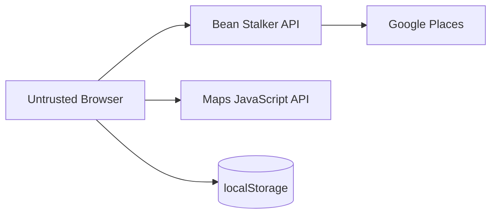

# Threat Model

## Assets

- server-side Google Places credential;
- browser credential quota/billing exposure;
- user precise location during active search;
- availability/cost budget of external API;
- integrity of cafe information presented to user.

## Trust boundaries

## Threats and controls

### T-01 server key leakage
Controls: server-only env secret, `.gitignore`, log redaction, code review, separate keys, rotation procedure.

### T-02 unrestricted browser key abuse
Controls: website/referrer + API restrictions, separate key, budget/usage monitoring.

### T-03 cost amplification
Controls: bounded radius/result count, explicit field mask, controlled query keys/refetch, no client-provided provider key, rate limiting if public abuse emerges.

### T-04 malicious/invalid search input
Controls: Zod validation, numeric bounds, body-size limit, stable errors.

### T-05 provider response shape change
Controls: adapter validation/normalization, tests with fixtures, `PROVIDER_BAD_RESPONSE`.

### T-06 privacy leakage through logs
Controls: avoid raw precise user coordinates, no query history DB, safe observability fields.

### T-07 localStorage corruption
Controls: versioned schema parsing and safe reset.

### T-08 stale/racing responses
Controls: TanStack Query key discipline, request abort/supersession, UI state tests.

### T-09 XSS/dependency compromise
Controls: React escaping defaults, avoid unsafe HTML, dependency review, CSP where deployment allows, no secrets in browser state.

## Required negative tests

See [[Test Case Catalog#Security]].
