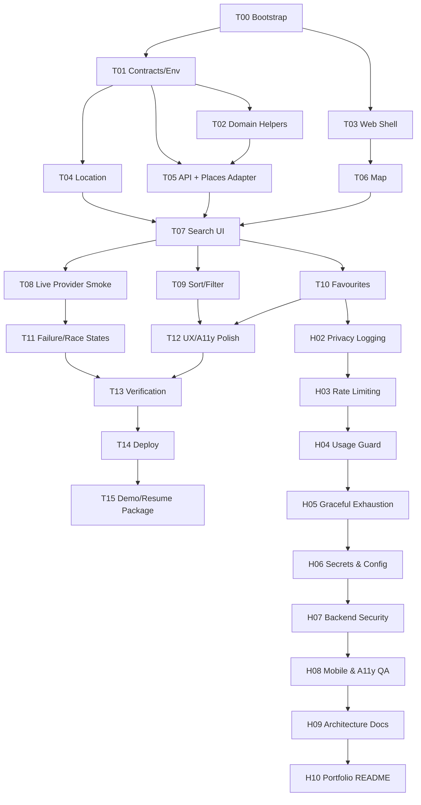

# Task Graph

```mermaid
flowchart TD
  T00[T00 Bootstrap] --> T01[T01 Contracts/Env]
  T01 --> T02[T02 Domain Helpers]
  T00 --> T03[T03 Web Shell]
  T01 --> T04[T04 Location]
  T01 --> T05[T05 API + Places Adapter]
  T02 --> T05
  T03 --> T06[T06 Map]
  T04 --> T07[T07 Search UI]
  T05 --> T07
  T06 --> T07
  T07 --> T08[T08 Live Provider Smoke]
  T07 --> T09[T09 Sort/Filter]
  T07 --> T10[T10 Favourites]
  T08 --> T11[T11 Failure/Race States]
  T09 --> T12[T12 UX/A11y Polish]
  T10 --> T12
  T11 --> T13[T13 Verification]
  T12 --> T13
  T13 --> T14[T14 Deploy]
  T14 --> T15[T15 Demo/Resume Package]

  %% Pre-T08 release-hardening chain — runs while T08 is blocked, independent
  %% of the T11–T15 line.
  T10 --> H02[H02 Privacy Logging]
  H02 --> H03[H03 Rate Limiting]
  H03 --> H04[H04 Usage Guard]
  H04 --> H05[H05 Graceful Exhaustion]
  H05 --> H06[H06 Secrets & Config]
  H06 --> H07[H07 Backend Security]
  H07 --> H08[H08 Mobile & A11y QA]
  H08 --> H09[H09 Architecture Docs]
  H09 --> H10[H10 Portfolio README]
```

Done: T00–T07, T09, T10, H02–H09. `H10` is the next `READY` task. `T08` is
`BLOCKED` (credentials); `T11`–`T15` are gated on it. See [[Task Status]] for
canonical execution state.
